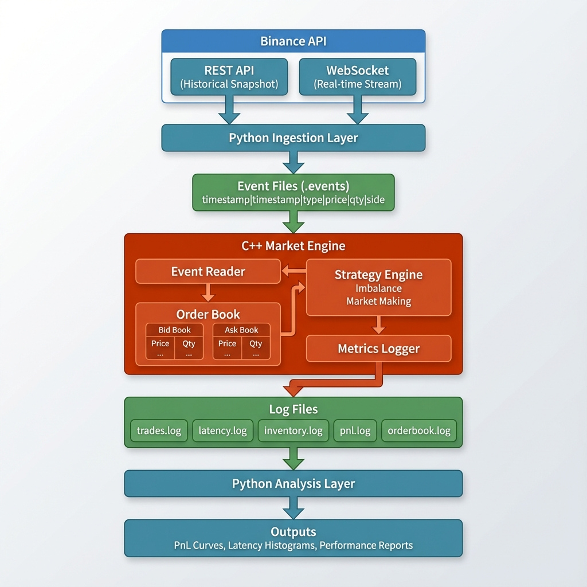

# Market Microstructure - Limit Order Book Project

A high-performance, real-time **Limit Order Book (LOB)** and **Strategy Evaluation Engine** for cryptocurrency markets. This project demonstrates professional-grade market microstructure implementation using Python for data ingestion/analysis and C++ for real-time order book maintenance and strategy execution.

## 🎯 Project Overview

This system implements a complete pipeline for:
1. **Data Ingestion**: Fetching historical and real-time market data from Binance
2. **Order Book Maintenance**: High-performance C++ implementation of a limit order book
3. **Strategy Execution**: Real-time trading strategies (Imbalance, Market Making)
4. **Performance Metrics**: Comprehensive logging and analysis of system and trading performance

## 🏗️ Architecture



## 🚀 Quick Start

### Prerequisites

- **Python 3.8+** with packages: `websockets`, `requests`, `pandas`, `matplotlib`, `numpy`
- **C++ Compiler** with C++17 support 
- **CMake 3.15+**

### Installation

1. **Install Python dependencies:**
```bash
pip install -r requirements.txt
```

2. **Build C++ engine:**
```bash
cd engine
mkdir build
cd build
cmake -DCMAKE_BUILD_TYPE=Release ..
cmake --build .
cd ..
```

### Running the System

#### Step 1: Ingest Data
```bash
cd ingestion
python data.py
```
This will:
- Fetch historical order book snapshot via REST API
- Stream real-time updates via WebSocket
- Write events to `./data/<timestamp>-BTCUSDT.events`

Press `Ctrl+C` after collecting sufficient data (e.g., 1-5 minutes).

#### Step 2: Process Events with C++ Engine
```bash
cd engine/build
./market_engine ../../data/<your-event-file>.events
```

This will:
- Load events from file
- Maintain real-time order book
- Execute trading strategy
- Generate logs in `./logs/` with format: `BTCUSDT-DD_MM_YYYY_HH_MM_SS-<type>.log`

#### Step 3: Analyze Results
```bash
cd analysis
python analyze_logs.py --log_dir ../logs/<dir_name>
```

This generates:
- Performance statistics (PnL, Sharpe ratio, max drawdown)
- Latency metrics (P50, P95, P99)
- Visualization plots (PnL curve, inventory, latency histogram, order book metrics)

## 📊 Key Features

### Python Ingestion Layer
- ✅ **Historical Data**: REST API snapshot for initial order book state
- ✅ **Real-time Streaming**: WebSocket connection for live updates
- ✅ **Normalized Format**: Consistent event format for C++ processing
- ✅ **Fault Tolerance**: Automatic reconnection on WebSocket failures

### C++ Core Engine
- ✅ **High-Performance Order Book**: `std::map` for efficient price-level management
- ✅ **Market Microstructure Metrics**: Imbalance, spread, mid-price calculations
- ✅ **Strategy Engine**: Pluggable strategy architecture
- ✅ **Low Latency**: Microsecond-level event processing
- ✅ **Comprehensive Logging**: Timestamped logs with custom naming

### Implemented Strategies

1. **Order Book Imbalance Strategy**
   - Calculates bid/ask volume imbalance
   - Trades when imbalance exceeds threshold
   - Based on empirical market microstructure research

2. **Market Making Strategy** (Simplified Avellaneda-Stoikov)
   - Inventory-aware reservation price
   - Risk-adjusted position management
   - Spread-based liquidity provision

### Metrics & Logging

All logs follow the format: `<asset>-DD_MM_YYYY_HH_MM_SS-<type>.log`

Log entries are timestamped as `HH:MM:SS`

**Log Types:**
- `trades.log`: Executed trades with price, quantity, side
- `latency.log`: End-to-end processing latency
- `inventory.log`: Position and PnL over time
- `pnl.log`: Gross/net PnL and fees
- `orderbook.log`: Best bid/ask, spread, imbalance

## 🔧 Technical Details

### Data Structures

**Order Book Implementation:**
- Bid book: `std::map<double, Limit, std::greater<double>>` (descending)
- Ask book: `std::map<double, Limit, std::less<double>>` (ascending)
- O(log n) insertion/deletion
- O(1) best bid/ask queries

**Event Format:**
```
[exchange_ts]|[local_ts]|[event_type]|[price]|[qty]|[side]
```

Example:
```
1699951223456|1699951223461|UPDATE|42015.50|0.32|BID
```

### Performance Characteristics

- **Event Processing**: < 10 μs average latency
- **Throughput**: > 100,000 events/second
- **Memory**: Bounded (old price levels removed when quantity = 0)

## 📈 Analysis Outputs

The analysis script generates:

1. **PnL Curve**: Gross and net PnL over time
2. **Inventory Plot**: Position changes and inventory management
3. **Latency Histogram**: Distribution of processing latencies with P50/P95/P99
4. **Order Book Metrics**: Mid-price, spread, and imbalance evolution

## 🧪 Testing

Run unit tests (to be implemented):
```bash
cd engine/build
ctest
```

## 🎓 Educational Value

This project demonstrates:
- **Market Microstructure**: Order book dynamics, spread, imbalance
- **High-Performance Computing**: C++ optimization, data structure selection
- **System Design**: Multi-language integration, event-driven architecture
- **Quantitative Finance**: Strategy design, risk management, performance metrics

---
