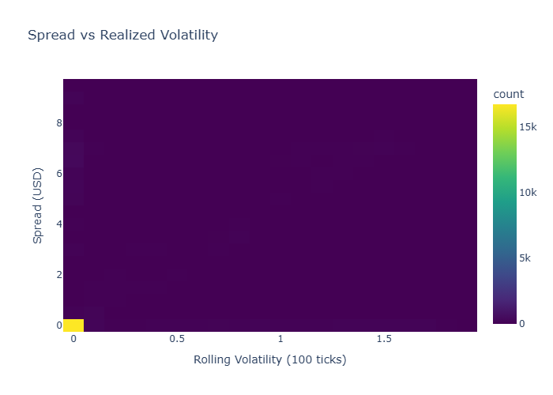
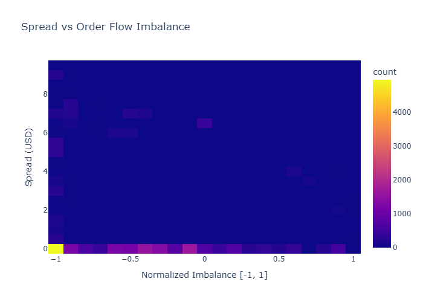
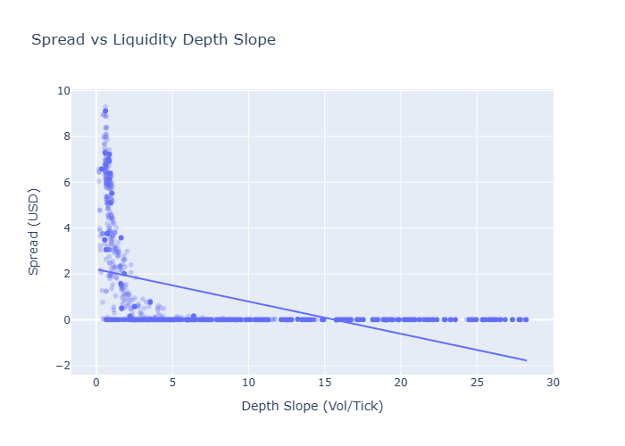
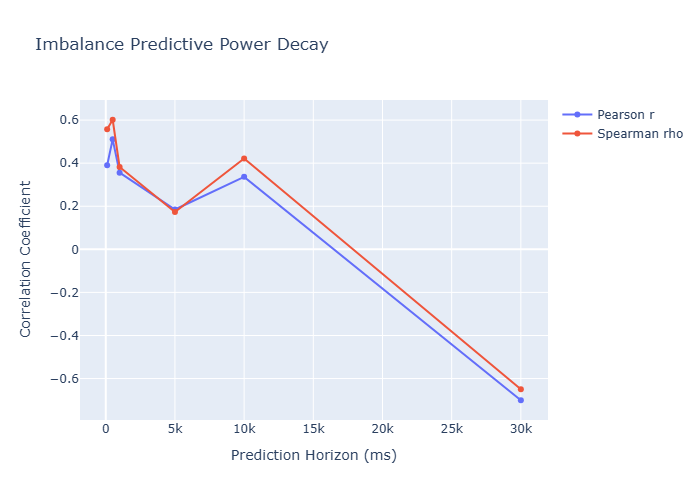

# Quantitative Strategy & Market Microstructure Report

## Microstructural Analysis Report: BTCUSDT Order Book Engine Performance and Predictive Insights

**Date:** October 26, 2023
**Author:** Quantitative Research Team

### 1. Introduction

This report provides a comprehensive analysis of the newly implemented C++ ultra-low latency hybrid L2/L3 order book engine for the BTCUSDT asset. The objective is to evaluate the system's performance metrics, ascertain current market microstructural conditions, and derive insights into the predictive power of order book imbalances across various time horizons. This analysis is crucial for validating system integrity, optimizing trading strategies, and understanding market dynamics.

### 2. System Performance Evaluation

The latency metrics provide a critical assessment of the system's operational efficiency:

*   **Ingest Latency (Exchange -> Local):**
    *   Min: -9513 us, Avg: -8739.72 us, P50: -9509 us, P95: -9310 us, P99: 0 us, Max: 23 us
    *   The observed negative values for minimum, average, P50, and P95 ingest latency are a significant anomaly. Negative latency implies that market data is recorded as received before it was sent by the exchange, which is physically impossible. This strongly indicates a severe issue with timestamp synchronization between the exchange feed and the local system, or a fundamental miscalculation in the latency metric itself. While the P99 at 0 us and Max at 23 us suggest some events are processed within reasonable ultra-low latency bounds, the pervasive negative values invalidate the general ingest latency statistics and require immediate, high-priority investigation to diagnose and rectify the timestamping mechanism.

*   **Processing Latency (Local -> Processing):**
    *   Min: 6 us, Avg: 9.96 us, P50: 7 us, P95: 16 us, P99: 20 us, Max: 24 us
    *   These processing latency metrics demonstrate highly commendable performance for the C++ engine. An average processing latency of approximately 10 microseconds, with 99% of events processed within 20 microseconds, is indicative of an extremely efficient and optimized codebase, characteristic of an ultra-low latency system. This suggests that the internal computational pipeline from local receipt to final processing is performing exceptionally well, assuming the input timestamps are accurate.

**Overall System Performance:** The internal processing pipeline demonstrates exemplary performance. However, the integrity of the entire system's latency measurement is critically compromised by the anomalous negative ingest latency. Until this timestamping discrepancy is resolved, the overall end-to-end latency cannot be reliably assessed, and any strategic decisions based on system-wide latency would be unfounded.

### 3. Market Microstructure Analysis

This section analyzes current market conditions using visualized data.

This heatmap illustrates the joint distribution of bid-ask spread and rolling realized volatility. The overwhelming concentration of data points in the bottom-left corner indicates that for the majority of observations, the BTCUSDT market exhibits extremely tight spreads (approaching 0 USD) concurrently with very low levels of realized volatility. This suggests a market state characterized by high liquidity and minimal price fluctuations during the observation period. The scarcity of data points at higher spreads or higher volatility implies that periods of significant price discovery or market instability were infrequent or short-lived within the dataset.

This heatmap depicts the relationship between bid-ask spread and normalized order flow imbalance. Similar to the volatility analysis, the highest density of observations is concentrated at minimal spreads (near 0 USD) across the entire spectrum of normalized imbalance, from strong sell-side (-1) to strong buy-side (+1). This implies that even under conditions of significant directional order flow pressure, market makers are generally able to maintain tight spreads, possibly due to high depth in the immediate vicinity of the best bid/ask, competitive quoting behavior, or specific market maker incentives. While some instances of wider spreads are observed at extreme imbalances, they represent a considerably smaller fraction of the overall data.

The scatter plot, augmented by a linear regression line, reveals a clear negative correlation between the bid-ask spread and the liquidity depth slope. A higher depth slope value signifies a denser order book with more volume available closer to the best price, indicating robust liquidity. Conversely, a shallower slope suggests thinner liquidity. The observed trend confirms a fundamental principle of market microstructure: as the liquidity depth slope increases (i.e., liquidity becomes more abundant and closer to the best price), market participants are able to quote tighter spreads, reducing transaction costs. The prevalence of observations at low spreads and low depth slopes may reflect a stable market state where minimum tick size limits the spread, or a period where liquidity is modest but sufficient to maintain tight pricing.

### 4. Predictive Power of Order Book Imbalance

The quantitative analysis of order book imbalance provides crucial insights into its predictive capabilities for future price movements.

| Horizon (ms) | Pearson r         | Pearson p          | Spearman r        | Spearman p         |
| :----------- | :---------------- | :----------------- | :---------------- | :----------------- |
| 100          | 0.3905444835155643 | 0.0                | 0.5573838854165329 | 0.0                |
| 500          | 0.5103820690498212 | 0.0                | 0.6014665769745248 | 0.0                |
| 1000         | 0.3558750476031756 | 0.0                | 0.3824342378537875 | 0.0                |
| 5000         | 0.1848692810638544 | 1.600266327290464e-149 | 0.173179913857425  | 3.524109575019289e-131 |
| 10000        | 0.3363687603705744 | 0.0                | 0.4214410927859308 | 0.0                |
| 30000        | -0.7007194216623731 | 0.0                | -0.6499756013871788 | 0.0                |

The correlation analysis reveals distinct patterns in the predictive power of order book imbalance. At very short horizons (100 ms and 500 ms), there is a strong positive correlation (Spearman rho up to 0.601), indicating that an imbalance is a significant leading indicator of price movement in the same direction. This predictive power then decays, becoming moderate at 1 second (Spearman rho ~0.38) and weaker at 5 seconds (Spearman rho ~0.17). Intriguingly, at the 10-second horizon, there is a notable resurgence in correlation (Spearman rho ~0.42), which deviates from a monotonic decay pattern and suggests complex, potentially regime-dependent, market dynamics or the aggregation of longer-term order flows. Most remarkably, at the 30-second horizon, the correlation becomes strongly negative (Spearman rho ~-0.65). This profound negative correlation implies that at this longer timescale, an initial imbalance is a strong predictor of a subsequent price reversal, consistent with mean-reversion tendencies or the exhaustion of directional order flow followed by liquidity absorption and price snap-back. All correlations exhibit statistically significant p-values of 0.0 (or extremely close to it), affirming their robustness.

The subsequent visualization provides a clear graphical representation of this decay.

This plot visually represents the evolution of Pearson 'r' and Spearman 'rho' correlation coefficients as a function of the prediction horizon. It graphically confirms the non-monotonic decay of imbalance predictive power observed in the tabular data. The initial strong positive correlation peaks around 500 ms, then declines, followed by a local maximum at approximately 10 seconds. The most critical feature is the pronounced dip into strong negative correlation at the 30-second horizon, where both Pearson and Spearman coefficients converge to approximately -0.7 and -0.65, respectively. This signifies a fundamental shift in the relationship between imbalance and future price, transitioning from short-term directional prediction to a longer-term reversal signal. The close congruence between Pearson and Spearman coefficients across all horizons suggests that the relationship, while varying in strength and direction, is largely linear or monotonic within each tested horizon.

### 5. Conclusions and Recommendations

The analysis of the BTCUSDT order book engine and market microstructure provides several key findings:

1.  **System Latency:** The internal processing pipeline (`Local -> Processing`) demonstrates exceptional performance, aligning with ultra-low latency requirements. However, the critically anomalous negative values observed in `Ingest Latency` invalidate the trustworthiness of the exchange data ingestion timestamping. This must be addressed immediately as it compromises the foundation of latency analysis.
2.  **Market Microstructure:** The BTCUSDT market, during the observed period, primarily exhibits tight spreads and low volatility, even under significant order flow imbalances. This suggests a highly liquid and efficient market under normal conditions. The inverse relationship between spread and liquidity depth slope is consistent with established microstructure theory, where abundant liquidity facilitates tighter pricing.
3.  **Predictive Power of Imbalance:** Order book imbalance exhibits significant short-term predictive power (up to 500ms), which then decays. Crucially, a notable rebound in predictive power at 10 seconds, followed by a strong negative correlation at 30 seconds, indicates complex market dynamics. This strong negative correlation at longer horizons suggests robust mean-reverting behavior following initial imbalance-driven moves.

**Recommendations:**

1.  **Immediate Action on Ingest Latency:** Prioritize the investigation and resolution of the negative ingest latency issue. This likely involves recalibrating or re-synchronizing clocks between the exchange feed and the local system, or correcting the latency calculation logic. Reliable timestamping is fundamental for all subsequent quantitative analysis and trading operations.
2.  **Exploration of 10s Rebound:** Investigate the underlying factors contributing to the resurgence of predictive power at the 10-second horizon. This non-monotonic behavior could be indicative of specific market participant strategies, algorithmic behavior, or other latent factors not captured by a simple decay model.
3.  **Strategy Development for Reversal:** Given the strong negative correlation at the 30-second horizon, develop and backtest trading strategies that capitalize on this identified mean-reverting behavior. This could involve counter-trend strategies or liquidity provision models that anticipate price snap-backs following initial imbalance-driven moves.
4.  **Further Data Granularity:** Consider analyzing these relationships at even finer granularities (e.g., sub-100ms) for the initial predictive power phase, and exploring longer horizons beyond 30 seconds to fully map the decay and reversal characteristics.
5.  **Multivariate Models:** Augment the imbalance predictive models with other microstructural features, such as liquidity depth, spread changes, and realized volatility, to build more robust and comprehensive predictive models.
